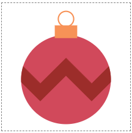

# 5. SVG에서 "clip-path"를 사용하는 방법

[Day1](./01_basic-shapes.md)에 그린 모양을 선으로 꾸며보자

기본적으로 폴리라인은 원 모양의 가장자리와 일치하지 않는다. 클리핑을 하지 않으면 다음과 같이 그려진다.


```html
<svg
  style="border: dashed grey 1px"
  width="200"
  height="200"
  viewBox="-100 -100 200 200"
>
  <circle cx="0" cy="20" r="70" fill="#D1495B" />
  <rect x="-17.5" y="-65" width="35" height="20" fill="#F79257" />
  <circle
    cx="0"
    cy="-75"
    r="12"
    fill="none"
    stroke="#F79257"
    stroke-width="2"
  />

  <polyline
    points="-120 40 -80 0 -40 40 0 0 40 40 80 0 120 40"
    fill="none"
    stroke="#9C2D2A"
    stroke-width="20"
  />
</svg>
```

해당 선이 장식품에 완벽하게 맞게 하기 위해 `clip-path`를 사용한다.

`clip-path`는 definitions section에 정의되어 있다. "defs section"은 이미지의 숨겨진 구획으로, 화면에 나타나지는 않지만 참조하여 사용할 수 있다.

여기서 우리는 ID를 가진 `clipPath`를 정의한다. clipPath의 내용은 장식의 크기와 같은 원이다. 그 다음 `clip-path` 속성을 설정하여 폴리라인을 자른다.



```html
<svg
  style="border: dashed grey 1px"
  width="200"
  height="200"
  viewBox="-100 -100 200 200"
>
  <circle cx="0" cy="20" r="70" fill="#D1495B" />
  <rect x="-17.5" y="-65" width="35" height="20" fill="#F79257" />
  <circle
    cx="0"
    cy="-75"
    r="12"
    fill="none"
    stroke="#F79257"
    stroke-width="2"
  />

  <defs>
    <clipPath id="ball">
      <circle cx="0" cy="20" r="70" />
    </clipPath>
  </defs>
  <polyline
    clip-path="url(#ball)"
    points="-120 40 -80 0 -40 40 0 0 40 40 80 0 120 40"
    fill="none"
    stroke="#9C2D2A"
    stroke-width="20"
  />
</svg>
```
